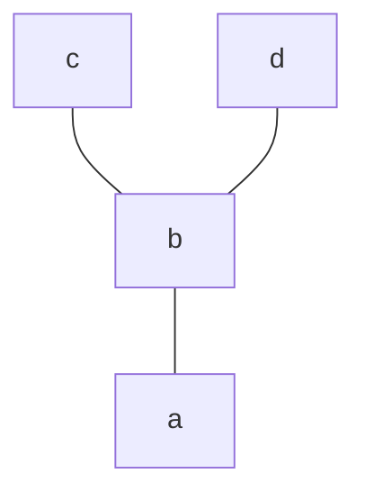

- O relatie binara $\le$ pe o mult. finita A se va reprezenta grafic prin diagrama Hasse astfel:
	- Elementele multimii sunt reprezentate prin puncte
	- Faptul ca $x < y \ \ (x \le y \text{, dar nu } x = y)$ si $\nexists$ alt element $z \in A$ a.i. $x < z < y$ se reprezinta printr-o linie care leaga cele 2 puncte, y fiind situat mai sus ca x
	  ```mermaid
	  graph TD;
	  y --- x
	  ```

- Ex.:
	- $A = \{a, b, c, d\}$
	- $\rho = \{(a,a), \ (b,b), \ (c,c), \ (d,d), \ (a,b), \ (a,c), \ (a,d), \ (b,c), \ (b,d)\}$
	- $(A, \rho)$ mult. ordonata

