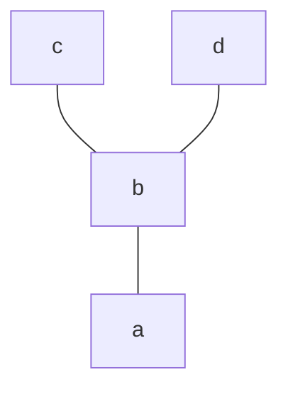
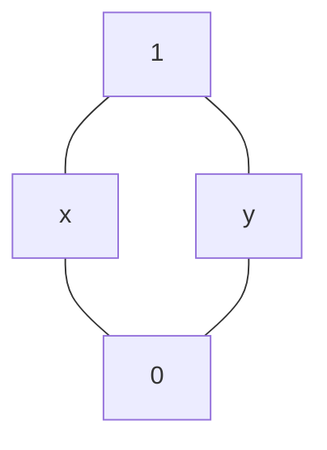
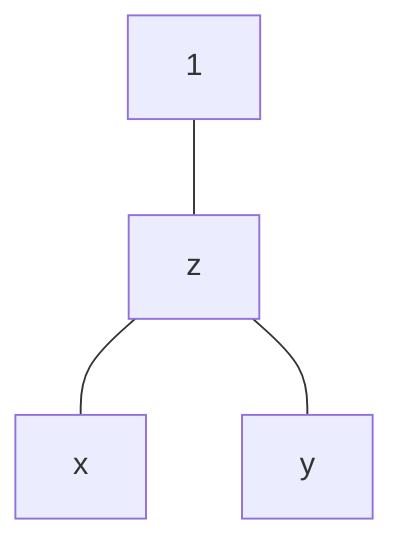
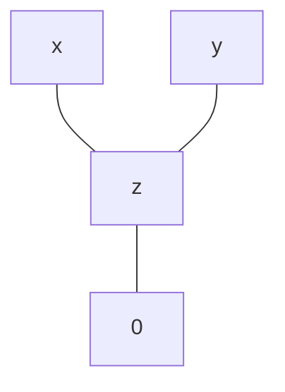

- O relatie binara $\le$ pe o mult. finita A se va reprezenta grafic prin diagrama Hasse astfel:
	- Elementele multimii sunt reprezentate prin puncte
	- Faptul ca $x < y \ \ (x \le y \text{, dar nu } x = y)$ si $\nexists$ alt element $z \in A$ a.i. $x < z < y$ se reprezinta printr-o linie care leaga cele 2 puncte, y fiind situat mai sus ca x
	- - Ex.:
		- $A = \{a, b, c, d\}$
		- $\rho = \{(a,a), \ (b,b), \ (c,c), \ (d,d), \ (a,b), \ (a,c), \ (a,d), \ (b,c), \ (b,d)\}$
		- $(A, \rho)$ mult. ordonata


- $(A, \le), \ (B, \le)$ mult. $\le. \ \ f : A \rightarrow B$ **izotona**: $x \le y \ \Rightarrow \ f(x) \le f(y), \ \ \forall x, y \in A$
- **Element zero**: $\hspace{0.55cm} \ u \le x, \ \forall x \in A \hspace{1cm}$ Not.: $0$
- **Element unitate**: $\ x \le u, \ \forall x \in A \hspace{1cm}$ Not.: $1$
`````col
````col-md

````

````col-md

````

````col-md

````
`````
- Fie $X \subseteq A, \ (A, \le)$
	- **Minorant** al lui X: $a \le x, \ \forall x \in X \hspace{1cm}$ **Infimul**: $inf \ A$ = cel mai mare minorant
	- **Majorant** al lui X: $x \le a, \ \forall x \in X \hspace{1cm}$ **Supremum**: $sup \ A$ = cel mai mic majorant
