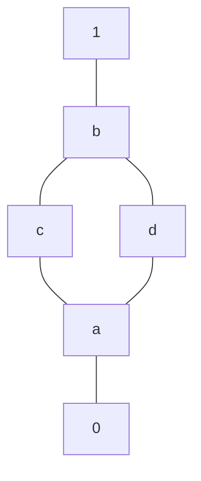

- **Latice**:
	1. $(L, \le)$, daca $\forall x,y \in L \ \ \exists \ sup(x,y)$ si $inf(x,y)$
	2. O structura algebrica $(L, \lor, \land)$ care satisface cele 4 axiome
		- Intr-o latice definita asa au loc:
			- $x \le y \ \ \Rightarrow \ \ \begin{cases} a \land x \le a \lor y \\ a \land x \le a \land y \end{cases} \hspace{1cm} \forall x,y,a \in L$
			- $x \le y, \ a \le b \ \ \Rightarrow \ \ \begin{cases} x \land a \le y \land b \\ x \lor a \le y \lor b \end{cases} \hspace{1cm} \forall a,b,x,y \in L$
	- Not.: $sup(x,y) = x \lor y \ \ \ inf(x,y) = x \land y$

- **Axiome** ale laticelor:
	- L1: *Idempotenta*: $\begin{cases} x \land x = x \\ x \lor x = x \end{cases} \hspace{1cm} \forall x \in L$
	- L2: *Comutativitate*: $\begin{cases} x \lor y = y \lor x \\ x \land y = y \land x \end{cases} \hspace{1cm} \forall x,y \in L$
	- L3: *Asociativitate*: $\begin{cases} x \lor (y \lor z) = (x \lor y) \lor z \\ x \land (y \land z) = (x \land y) \land z \end{cases} \hspace{1cm} \forall x,y \in L$
	- L4: *Absorbtie*: $\begin{cases} x \land (x \lor y) = x \\ x \lor (x \land y) = x \end{cases} \hspace{1cm} \forall x, y \in L$

- Observatii:
	- Daca $x \land y = x \ \ \ \Leftrightarrow \ \ \ x \lor y = (x \land y) \lor y = y$
	- Daca $x \lor y = y \ \ \ \Leftrightarrow \ \ \ x \land y = x \land (x \lor y) = x$
	- Intr-o latice cu el. 0 si 1 au loc:
		- $\begin{cases} 0 \land x = 0 \\ 0 \lor x = x \end{cases} \hspace{1cm} \begin{cases} 1 \land x = x \\ 1 \lor x = 1 \end{cases} \hspace{1cm} \forall x \in L$

- Latice distributiva: latice + $\begin{cases} x \land (y \lor z) \ = \ (x \land y) \ \lor \ (x \land z) \\ x \land (y \lor z) \ = \ (x \lor y) \ \land \ (x \lor z) \end{cases} \hspace{1cm} \forall x,y,z \in L$
	- Mult. laticelor distr. cu el. $0$ si $1$ = $L_d(0,1)$
		- $\forall$ morf. $\in$ $L_d(0,1)$ este o func. izotona
	- **Complement**: $\begin{cases} a \land \bar a = 0 \\ a \lor \bar a = 1 \end{cases}$
		- Intr-o latice distr. cu el. 0 si 1, $\forall$ el. poate avea max. un complement

- **Morfism laticeal**: $\begin{cases} f(x \lor y) = f(x) \lor f(y) \\ f(x \land y) = f(x) \land f(y) \\ f(0_1) = 0_2 \\ f(1_1) = 1_2 \end{cases}$
	- **Izomorfirsm**: morfism + bijectiv
	- **Automorfism**: izomorfism $L \rightarrow L$
	- **Endomorfism**: morfism $L \rightarrow L$

---

`````col
````col-md
Ex.: Fie A laticea

````

````col-md
Laticea A are 2 automorfisme:
1. $f_1 \ :$ morfismul identic $= f_1 = 1$
2. $f_2 \ : \begin{cases} f_2(0) = 0 \\ f_2(a) = a \\ f_2(b) = b \\ f_2(c) = d \\ f_2(d) = c \\ f_2(1) = 1 \end{cases}$

Argumentul are la baza observatia ca daca A este latice distr. cu 0 si 1, iar $f: A \rightarrow A$ este morfism, atunci:
$\forall x,y \in A, \ x \le y \ \Rightarrow \ f(x) \le f(y)$.
````
`````
